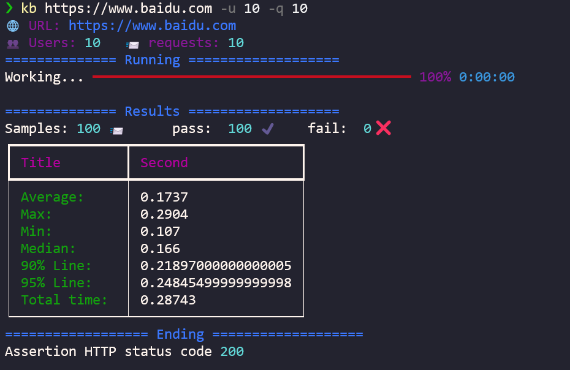

# kb

kb 是一个简单的性能测试脚本，通过`协程`模拟并发请求。

## Installation

```shell
> git clone https://github.com/SeldomQA/kb
> cd kb
> python3 setup.py install
```

or

```shell
> pip3 clone git+https://github.com/SeldomQA/kb.git --upgrade
```

## 使用

查看帮助：

```py
> kb --help
usage: kb [-h] [-v] [-u USERS] [-q REQUESTS] [url]

kb is a simple performance testing tool, Simulate concurrent requests through
a coroutine.

positional arguments:
  url                   URL to hit

optional arguments:
  -h, --help            show this help message and exit
  -v, --version         show version
  -u USERS, --users USERS
                        Number of concurrent users
  -q REQUESTS, --requests REQUESTS
                        Number of requests
```

## 运行

通过`kb`命令实现URL并发请求


